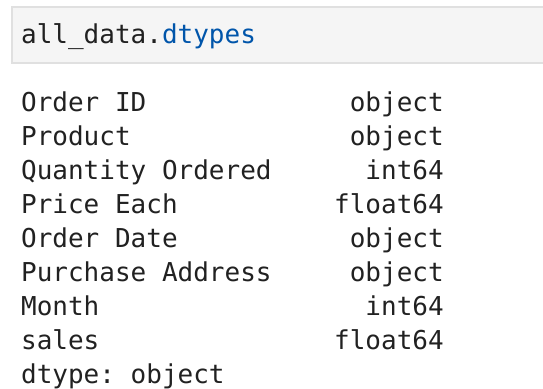
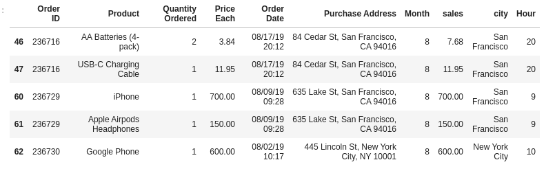

# Project 4 Sales Data Analysis

## a.- Preparar los datos
1. [Combine 12 meses de datos de ventas en un solo archivo csv](#schema1)
2. [Limpieza y formateo de datos](#schema2)
## b.- Analizando las ventas mensuales
3. [¿Cuál es el mejor mes para la venta?](#schema3)

## c.- Analizando el pedido máximo 
4. [¿Qué ciudad tiene el pedido máximo?](#schema4)
5. [¿A qué hora debemos mostrar anuncios para maximizar la compra de productos?](#schema5)

## d.- Analizando los productos más vendidos
6. [¿Qué producto se vendió más? & ¿Por qué?](#schema6)
7. [¿Qué productos se venden juntos con mayor frecuencia?](#schema7)

# 1. Combine 12 meses de datos de ventas en un solo archivo csv
Imprimimos el nombre de los datos que tenemos en la carpeta `data`.
~~~python
files =[file for file in os.listdir("./data")]
for file in files:
    print(file)
~~~

Creamos un dataframe con todos los archivos
~~~python
path = "./data"

#blank dataframe
all_data = pd.DataFrame()

for file in files:
    current_df = pd.read_csv(path+"/"+file)
    all_data = pd.concat([all_data, current_df])
    
~~~
Y obtenemos uno datos totales `(186850, 6)`

Guardamos los datos en un csv
~~~python
all_data.to_csv('./data/all_data.csv',index=False)
~~~

# 2. Limpieza y formateo de datos
~~~python
all_data.dtypes
all_data.head()
~~~

Comprobamos si tiene nulos y si no son muchos los borramos, ya que tenmos un dataframe grande.

~~~python
all_data.isnull().sum()
all_data = all_data.dropna(how='all')
~~~

# 3. ¿Cuál es el mejor mes para la venta?
Primero vamos a obtener los meses.
Para eso creamos una función y se la aplicamos a los datos y los guardamos como una nueva columna.

~~~python
def month(x):
    return x.split('/')[0]
all_data['Month']=all_data['Order Date'].apply(month)
~~~

Ahora los convertimos a enteros
~~~python
all_data['Month'] = all_data['Month'].astype(int)
~~~
Pero da un error porque hay un tipo de datos que no lo podemos convertir a enteros. Vamos ver los valores únicos a ver que dato es.

~~~python
all_data['Month'].unique()
~~~

~~~python
filter=all_data['Month']=='Order Date'
all_data=all_data[~filter]
~~~

Después de eliminar todos los datos con mes igual a `order date` ahora si podemos aplicar el cambio de tipo.

También cambiamos los tipos de `Price each` y `Quantity Ordered`
~~~python
all_data['Price Each']=all_data['Price Each'].astype(float)
all_data['Quantity Ordered']=all_data['Quantity Ordered'].astype(int)
~~~

Obtenemos el valor de las ventas
~~~python
all_data['sales']=all_data['Quantity Ordered']*all_data['Price Each']
~~~

Agrupamos por el mes y obtenemos las ventas
~~~python
all_data.groupby('Month')['sales'].sum()
~~~

Lo vemos mejor en un gráfico de barras

~~~python
months=range(1,13)
plt.bar(months,all_data.groupby('Month')['sales'].sum())
plt.xticks(months)
plt.ylabel('Sales in USD ($)')
plt.xlabel('Month number')
plt.show()
~~~
Y comprobamos que el mejor mes de ventas es el mes de `diciembre`

# 4. ¿Qué ciudad tiene el pedido máximo?
Primero vamos a obtener las ciudades.

~~~python
def city(x):
    return x.split(', ')[1]
all_data['city']=all_data['Purchase Address'].apply(city)
all_data.groupby('city')['city'].count()
~~~

Y ahora hacemos un gráfico con las ciudades y las `received orders`
~~~python
plt.bar(all_data.groupby('city')['city'].count().index,all_data.groupby('city')['city'].count())
plt.xticks(rotation='vertical')
plt.ylabel('received orders')
plt.xlabel('city names')
plt.show()
~~~

Y comprobamos que `San Francisco` es la ciudad con mas ventas.

# 5. ¿A qué hora debemos mostrar anuncios para maximizar la compra de productos?

Creamos una columna nueva `Hour` con las horas de los pedidos
~~~python
all_data['Hour'] = pd.to_datetime(all_data['Order Date']).dt.hour
~~~

~~~python
keys=[]
hour=[]
for key,hour_df in all_data.groupby('Hour'):
    keys.append(key)
    hour.append(len(hour_df))
~~~
Donde las keys son las horas y las hour contienen las cantidad de pedidos a esa hora.
~~~python
plt.grid()
plt.plot(keys,hour)
plt.savefig("./images/k_h.png")
~~~

Donde podemos comprobar que las mejores horas para poner anuncios son sobre las 12 y las 19

# 6. ¿Qué producto se vendió más? & ¿Por qué?
~~~python
all_data.groupby('Product')['Quantity Ordered'].sum().plot(kind='bar')

~~~

Precio medio de cada producto
~~~python
all_data.groupby('Product')['Price Each'].mean()
~~~

Creamos un nuevo data y vemos la relación entre el precio y la cantidad de ventas.
~~~python
products=all_data.groupby('Product')['Quantity Ordered'].sum().index
quantity=all_data.groupby('Product')['Quantity Ordered'].sum()
prices=all_data.groupby('Product')['Price Each'].mean()
plt.figure(figsize=(40,24))
fig,ax1 = plt.subplots()
ax2=ax1.twinx()
ax1.bar(products, quantity, color='g')
ax2.plot(products, prices, 'b-')
ax1.set_xticklabels(products, rotation='vertical', size=8)
plt.savefig("./images/prices.png")
~~~

El producto más vendido son las 'Pilas AAA'. Los productos más vendidos parecen tener una correlación con el precio del producto. Cuanto más barato sea el producto, mayor será la cantidad pedida y viceversa.

# 7. ¿Qué productos se venden juntos con mayor frecuencia?
Tenemos que buscar las mismas órdenes

~~~python
df=all_data[all_data['Order ID'].duplicated(keep=False)]
~~~

Buscamos los productos dentro de las órdenes
~~~python
df['Grouped'] = df.groupby('Order ID')['Product'].transform(lambda x: ','.join(x))
~~~

Ahora tenemos duplicados las `Order ID`y  `Grouped`
~~~python
df2 = df.drop_duplicates(subset=['Order ID'])
df2['Grouped'].value_counts()[0:5].plot.pie()
~~~
